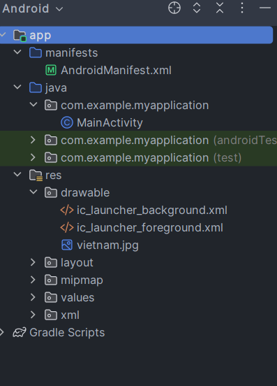
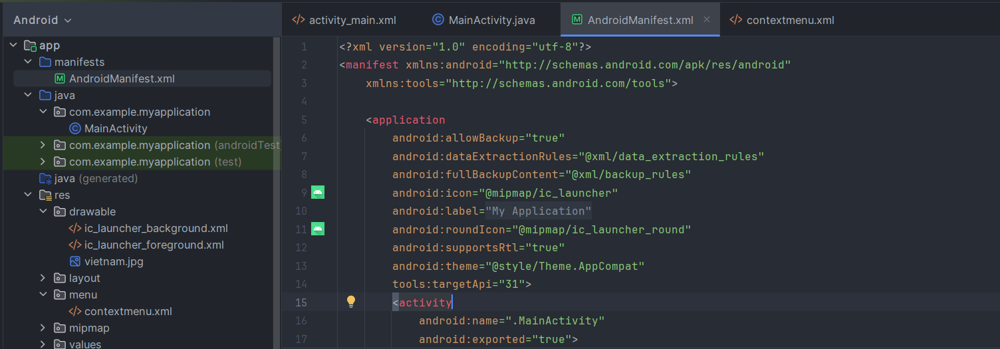
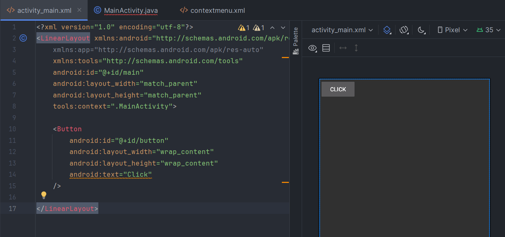
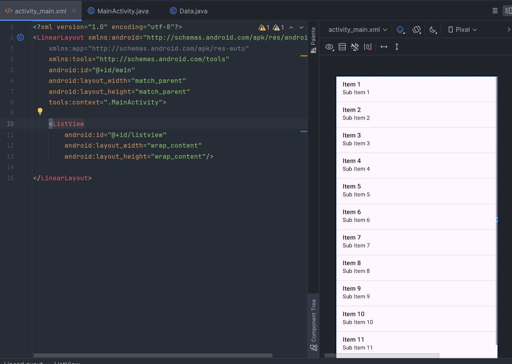
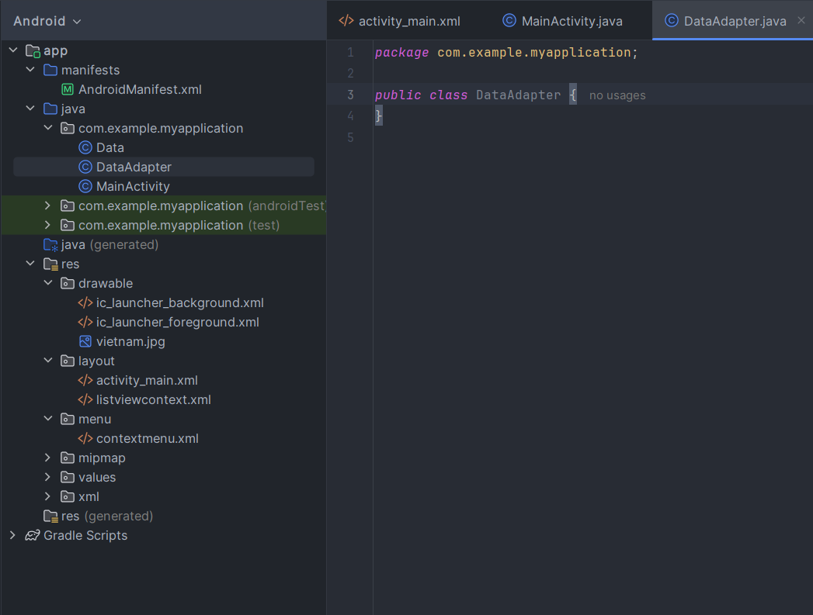
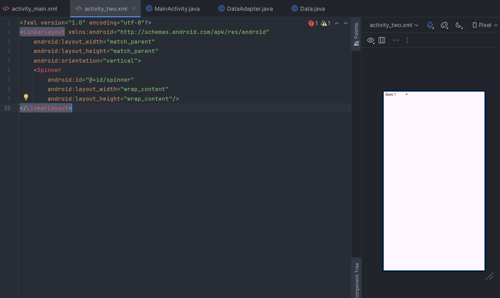

# Android Studio giáo trình học

## ImageView - ImageButton



Gán ảnh vào đường link như trong hình (trong ví dụ là vietnam.jpg)


```xml
<ImageView
    android:layout_width="wrap_content"
    android:layout_height="match_parent"
    android:src="@drawable/vietnam"
/>
```

## CheckBox


```xml
<CheckBox
    android:layout_width="wrap_content"
    android:layout_height="wrap_content"
    android:id="@+id/checkbox"
    android:text="duytung"
    android:textStyle="bold"
/>
```

```java
public class MainActivity extends Activity {
    CheckBox checkbox;
    @Override
    protected void onCreate(Bundle savedInstanceState) {
        super.onCreate(savedInstanceState);
        setContentView(R.layout.activity_main);
        checkbox = findViewById(R.id.check);
        if (checkbox.isChecked()){
            Toast.makeText(getApplicationContext(), "True", Toast.LENGTH_SHORT).show();
        }
    }
}
```

## RadioButton - RadioGroup


```xml
<RadioGroup
    android:id="@+id/GroupRadioButton"
    android:layout_width="wrap_content"
    android:layout_height="wrap_content"
    android:orientation="vertical">
    <RadioButton
        android:id="@+id/ButtonOne"
        android:layout_width="wrap_content"
        android:layout_height="wrap_content"
        android:text="Button One"
    />
    <RadioButton
        android:id="@+id/ButtonTwo"
        android:layout_width="wrap_content"
        android:layout_height="wrap_content"
        android:text="Button Two"
    />
    <RadioButton
        android:id="@+id/ButtonThree"
        android:layout_width="wrap_content"
        android:layout_height="wrap_content"
        android:text="Button Three"
    />
</RadioGroup>
<Button
    android:id="@+id/btn"
    android:layout_width="wrap_content"
    android:layout_height="wrap_content"
    android:text="CLick"
/>
```

```java
public class MainActivity extends Activity {
    RadioGroup groupArrays;
    Button click;
    @Override
    protected void onCreate(Bundle savedInstanceState) {
        super.onCreate(savedInstanceState);
        setContentView(R.layout.activity_main);
        groupArrays = findViewById(R.id.GroupRadioButton);
        click = findViewById(R.id.btn);
        click.setOnClickListener(new View.OnClickListener() {
            @Override
            public void onClick(View view) {
                int temp = groupArrays.getCheckedRadioButtonId();
                if (temp == -1){
                    Toast.makeText(MainActivity.this, "Chưa chọn Radio Button", Toast.LENGTH_SHORT).show();
                    return;
                }
                RadioButton radioButton = findViewById(groupArrays.getCheckedRadioButtonId());
                String text = radioButton.getText().toString();
                String topic;
                /*logic*/
            }
        });
    }
}
```

## SeekBar


```xml
<SeekBar
    android:id="@+id/seekBarDemo"
    android:layout_width="match_parent"
    android:layout_height="wrap_content"
    android:max="100"
    android:progress="10"
/>
```

```java
public class MainActivity extends Activity {
    SeekBar processSeekbar;
    @Override
    protected void onCreate(Bundle savedInstanceState) {
        super.onCreate(savedInstanceState);
        setContentView(R.layout.activity_main);
        processSeekbar = findViewById(R.id.seekBarDemo);
        processSeekbar.getMax(); //lấy giá trị lớn nhất
        processSeekbar.getProgress(); // lấy giá trị hiện tại
        processSeekbar.setMax(100);
        processSeekbar.setProgress(20);
        processSeekbar.setOnSeekBarChangeListener(new SeekBar.OnSeekBarChangeListener() {
            @Override
            public void onProgressChanged(SeekBar seekBar, int i, boolean b) {
                /*process is changing*/
            }
            @Override
            public void onStartTrackingTouch(SeekBar seekBar) {
                /**/
            }
            @Override
            public void onStopTrackingTouch(SeekBar seekBar) {
                /*process is saved after user choose value*/
            }
        });
    }
}
```

## OptionMenu


Tạo một Directory tại res là menu -> tạo một Menu Resource File và đặt tên không có chữ hoa


```xml
<?xml version="1.0" encoding="utf-8"?>
<menu xmlns:android="http://schemas.android.com/apk/res/android">
    <item android:id="@+id/one"
        android:title="Nội dung"/>
    <item android:id="@+id/two"
        android:title="Nội dung"/>
    <item android:id="@+id/three"
        android:title="Nội dung"/>
</menu>
```

```java
public class MainActivity extends AppCompatActivity {
    @Override
    protected void onCreate(Bundle savedInstanceState) {
        super.onCreate(savedInstanceState);
        setContentView(R.layout.activity_main);
    }
    @Override
    public boolean onCreateOptionsMenu(Menu menu) {
        MenuInflater inflater = getMenuInflater();
        inflater.inflate(R.menu.contextmenu, menu);
        return super.onCreateOptionsMenu(menu);
    }
    @Override
    public boolean onOptionsItemSelected(@NonNull MenuItem item) {
        int items = item.getItemId();
        if (items == R.id.one){
            /*logic*/
        }else if(items == R.id.two){
            /*logic*/
        }else if(items == R.id.three){
            /*logic*/
        }else{
            /*logic*/
        }
        return super.onOptionsItemSelected(item);
    }
}
```

Chương trình khi chạy vẫn chưa hiện OptionMenu thì thực hiện theo các bước sau

> Trỏ vào app -> manifests -> AndroidManifest.xml

Dòng 13 chỉnh từ android:theme="@style/Theme.MyApplication" sang android:theme="@style/Theme.AppCompat" là được



## Context Menu

Tạo Menu Resource File tương tự như OptionMenu

```java
public class MainActivity extends AppCompatActivity {
    @Override
    protected void onCreate(Bundle savedInstanceState) {
        super.onCreate(savedInstanceState);
        setContentView(R.layout.activity_main);
    }
    @Override
    public void onCreateContextMenu(ContextMenu menu, View v, ContextMenu.ContextMenuInfo menuInfo) {
        super.onCreateContextMenu(menu, v, menuInfo);
        MenuInflater inflater = getMenuInflater();
        inflater.inflate(R.menu.contextmenu, menu);
    }
    @Override
    public boolean onContextItemSelected(@NonNull MenuItem item) {
        int mind = item.getItemId();
        if(mind == R.id.one){
            /*logic*/
            Toast.makeText(this, "Nội dung", Toast.LENGTH_SHORT).show();
        }else if(mind == R.id.two){
            /*logic*/
            Toast.makeText(this, "Nội dung", Toast.LENGTH_SHORT).show();
        }else if(mind == R.id.three){
            /*logic*/
            Toast.makeText(this, "Nội dung", Toast.LENGTH_SHORT).show();
        }
        return super.onContextItemSelected(item);
    }
}
```

## Dialog



```xml
<Button
    android:id="@+id/button"
    android:layout_width="wrap_content"
    android:layout_height="wrap_content"
    android:text="Click"
/>
```

```java
public class MainActivity extends AppCompatActivity {
    Button btn;
    @Override
    protected void onCreate(Bundle savedInstanceState) {
        super.onCreate(savedInstanceState);
        setContentView(R.layout.activity_main);
        btn = findViewById(R.id.button);
        btn.setOnClickListener(new View.OnClickListener() {
            @Override
            public void onClick(View view) {
                showDialog();
            }
        });
    }
    private void showDialog(){
        AlertDialog dialog = new AlertDialog.Builder(this).create();
        dialog.setTitle("Title");
        dialog.setIcon(R.drawable.ic_launcher_background);
        dialog.setMessage("Questions ?");
        dialog.setButton(DialogInterface.BUTTON_POSITIVE, "Yes", new DialogInterface.OnClickListener() {
            @Override
            public void onClick(DialogInterface dialogInterface, int i) {
                finish();
            }
        });
        dialog.setButton(DialogInterface.BUTTON_NEGATIVE, "No", new DialogInterface.OnClickListener() {
            @Override
            public void onClick(DialogInterface dialogInterface, int i) {
                /*logic*/
            }
        });
        dialog.show();
    }
}
```

## ListView

Vào app -> res -> layout tạo Layout Resource File


```xml
<?xml version="1.0" encoding="utf-8"?>
<LinearLayout xmlns:android="http://schemas.android.com/apk/res/android"
    android:layout_width="match_parent"
    android:layout_height="match_parent"
    xmlns:app="http://schemas.android.com/apk/res-auto"
    android:orientation="horizontal">
    <ImageView
        android:id="@+id/imageView"
        android:layout_width="wrap_content"
        android:layout_height="wrap_content"
        app:srcCompat="@drawable/vietnam" />
    <LinearLayout
        android:layout_width="wrap_content"
        android:layout_height="wrap_content"
        android:orientation="vertical"
        >
        <TextView
            android:id="@+id/nameContry"
            android:layout_width="wrap_content"
            android:layout_height="wrap_content"
            android:text="Text View"/>
        <TextView
            android:id="@+id/population"
            android:layout_width="wrap_content"
            android:layout_height="wrap_content"
            android:text="Text View"/>
    </LinearLayout>
</LinearLayout>
```

Tạo một Java Class bằng app -> java -> com.example.myapplication + chuột phải chọn New -> Java Class


```java
package com.example.myapplication;

public class Data {
    private int flags;
    private String nameCoutrys;
    private int populations;
    public int getFlags() {
        return flags;
    }
    public void setFlags(int flags) {
        this.flags = flags;
    }
    public int getPopulations() {
        return populations;
    }
    public void setPopulations(int populations) {
        this.populations = populations;
    }
    public String getNameCoutrys() {
        return nameCoutrys;
    }
    public void setNameCoutrys(String nameCoutrys) {
        this.nameCoutrys = nameCoutrys;
    }
    public Data(int flags, int populations, String nameCoutrys) {
        this.flags = flags;
        this.populations = populations;
        this.nameCoutrys = nameCoutrys;
    }
}
```

Trong file activity_main.xml



```xml
<?xml version="1.0" encoding="utf-8"?>
<LinearLayout xmlns:android="http://schemas.android.com/apk/res/android"
    xmlns:app="http://schemas.android.com/apk/res-auto"
    xmlns:tools="http://schemas.android.com/tools"
    android:id="@+id/main"
    android:layout_width="match_parent"
    android:layout_height="match_parent"
    tools:context=".MainActivity">
    <ListView
        android:id="@+id/listview"
        android:layout_width="wrap_content"
        android:layout_height="wrap_content"/>
</LinearLayout>
```

Tạo một file Java Class tương tự ở trên là Adapter



```java
public class DataAdapter extends BaseAdapter {
    private Context context;
    private ArrayList<Data> dataArrayList;
    public DataAdapter(Context context, ArrayList<Data> dataArrayList) {
        this.context = context;
        this.dataArrayList = dataArrayList;
    }
    public Context getContext() {
        return context;
    }
    public void setContext(Context context) {
        this.context = context;
    }
    public ArrayList<Data> getDataArrayList() {
        return dataArrayList;
    }
    public void setDataArrayList(ArrayList<Data> dataArrayList) {
        this.dataArrayList = dataArrayList;
    }
    @Override
    public int getCount() {
        return dataArrayList.size();
    }
    @Override
    public Object getItem(int i) {
        return dataArrayList.get(i);
    }
    @Override
    public long getItemId(int i) {
        return i;
    }
    @Override
    public View getView(int i, View view, ViewGroup viewGroup) {
        if(view == null){
            LayoutInflater layoutInflater = LayoutInflater.from(context);
            view =  layoutInflater.inflate(R.layout.listviewcontext, viewGroup, false);
        }
        Data data = (Data) getItem(i);
        ImageView imageView =view.findViewById(R.id.imageView);
        TextView names = view.findViewById(R.id.nameContry);
        TextView populations = view.findViewById(R.id.population);
        imageView.setImageResource(data.getFlags());
        names.setText(data.getNameCoutrys());
        populations.setText("Population: " + data.getPopulations());
        return view;
    }
}
```

Tại MainActivity.java viết sự kiện cho ListView

```java
public class MainActivity extends AppCompatActivity {
    ListView listView;
    ArrayList<Data> dataArrayList;
    DataAdapter dataAdapter;
    @Override
    protected void onCreate(Bundle savedInstanceState) {
        super.onCreate(savedInstanceState);
        setContentView(R.layout.activity_main);
        listView = findViewById(R.id.listview);
        dataArrayList = new ArrayList<Data>();
        dataArrayList.add(new Data(R.drawable.usa, 12000, "USA"));
        dataArrayList.add(new Data(R.drawable.vietnam, 5600, "Viet Nam"));
        dataAdapter = new DataAdapter(this, dataArrayList);
        listView.setAdapter(dataAdapter);
    }
}
```

## Spinner



```xml
<?xml version="1.0" encoding="utf-8"?>
<LinearLayout xmlns:android="http://schemas.android.com/apk/res/android"
    android:layout_width="match_parent"
    android:layout_height="match_parent"
    android:orientation="vertical">
    <Spinner
        android:id="@+id/spinner"
        android:layout_width="wrap_content"
        android:layout_height="wrap_content"/>
</LinearLayout>
```

```java
public class MainActivity extends AppCompatActivity {
    Spinner spinnerData;
    @Override
    protected void onCreate(Bundle savedInstanceState) {
        super.onCreate(savedInstanceState);
        setContentView(R.layout.activity_two);
        final ArrayList<String> items = new ArrayList<String>();
        final ArrayAdapter<String> adapter = new ArrayAdapter<String>(this, androidx.appcompat.R.layout.support_simple_spinner_dropdown_item, items);
        spinnerData = findViewById(R.id.spinner);
        items.add("Tom (Admin)");
        items.add("Jerry (Users)");
        adapter.notifyDataSetChanged();
        spinnerData.setAdapter(adapter);
        spinnerData.setOnItemSelectedListener(new AdapterView.OnItemSelectedListener() {
            @Override
            public void onItemSelected(AdapterView<?> adapterView, View view, int i, long l) {
                setTitle("Selected: " + items.get(i));
            }

            @Override
            public void onNothingSelected(AdapterView<?> adapterView) {

            }
        });
    }
}
```