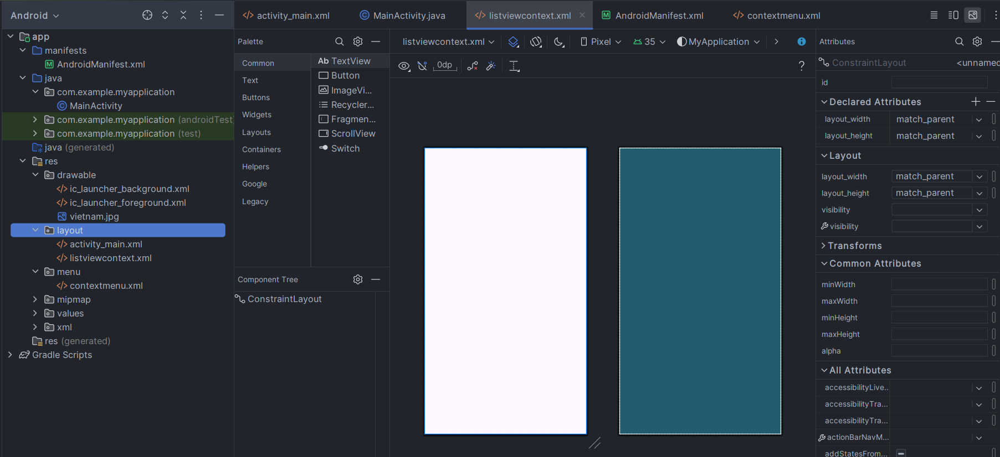
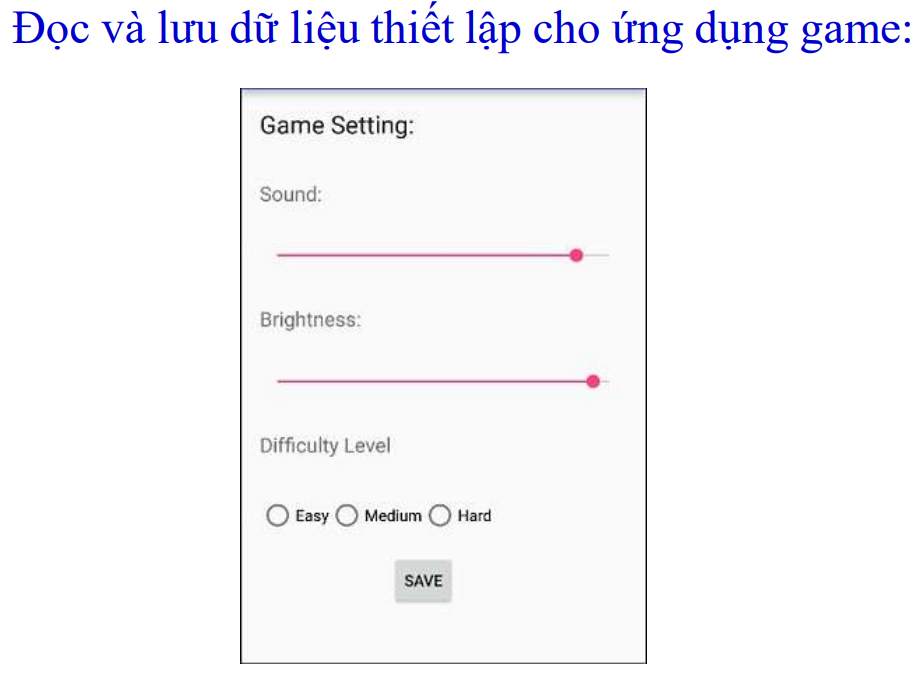

# Android Studio giáo trình học

## Intent

- Tạo Activity mới khi tạo sẽ kèm theo một xml và java


activity_main.xml
```xml
<?xml version="1.0" encoding="utf-8"?>
<LinearLayout xmlns:android="http://schemas.android.com/apk/res/android"
    xmlns:app="http://schemas.android.com/apk/res-auto"
    xmlns:tools="http://schemas.android.com/tools"
    android:id="@+id/main"
    android:layout_width="match_parent"
    android:layout_height="match_parent"
    tools:context=".MainActivity"
    android:orientation="vertical">
    <Button
        android:id="@+id/btnMain"
        android:layout_width="wrap_content"
        android:layout_height="wrap_content"
        android:text="Activity 2"/>
</LinearLayout>
```

MainActivity.java
```java
public class MainActivity extends AppCompatActivity {
    Button btnActivity;
    @Override
    protected void onCreate(Bundle savedInstanceState) {
        super.onCreate(savedInstanceState);
        setContentView(R.layout.activity_main);
        btnActivity = findViewById(R.id.btnMain);
        btnActivity.setOnClickListener(new View.OnClickListener() {
            @Override
            public void onClick(View view) {
                Intent intent = new Intent(getApplicationContext(), MainActivityIntent.class);
                startActivity(intent);
            }
        });
    }
}
```

activity_main_intent.xml
```xml
<?xml version="1.0" encoding="utf-8"?>
<LinearLayout xmlns:android="http://schemas.android.com/apk/res/android"
    xmlns:app="http://schemas.android.com/apk/res-auto"
    xmlns:tools="http://schemas.android.com/tools"
    android:id="@+id/main"
    android:layout_width="match_parent"
    android:layout_height="match_parent"
    tools:context=".MainActivityIntent"
    android:orientation="vertical">
    <Button
        android:id="@+id/btnIntent"
        android:layout_width="wrap_content"
        android:layout_height="wrap_content"
        android:text="Activity 1"/>
</LinearLayout>
```

MainActivityIntent.java
```java
public class MainActivityIntent extends AppCompatActivity {
    Button btnMain;
    @Override
    protected void onCreate(Bundle savedInstanceState) {
        super.onCreate(savedInstanceState);
        EdgeToEdge.enable(this);
        setContentView(R.layout.activity_main_intent);
        btnMain = findViewById(R.id.btnIntent);
        btnMain.setOnClickListener(new View.OnClickListener() {
            @Override
            public void onClick(View view) {
                Intent intent = new Intent(getApplicationContext(), MainActivity.class);
                startActivity(intent);
            }
        });
    }
}
```

Chương 2 02 để kham khảo thêm

## ImageView - ImageButton


Gán ảnh vào đường link như trong hình (trong ví dụ là vietnam.jpg)


```xml
<ImageView
    android:layout_width="wrap_content"
    android:layout_height="match_parent"
    android:src="@drawable/vietnam"
/>
```

## CheckBox


```xml
<CheckBox
    android:layout_width="wrap_content"
    android:layout_height="wrap_content"
    android:id="@+id/checkbox"
    android:text="duytung"
    android:textStyle="bold"
/>
```

```java
public class MainActivity extends Activity {
    CheckBox checkbox;
    @Override
    protected void onCreate(Bundle savedInstanceState) {
        super.onCreate(savedInstanceState);
        setContentView(R.layout.activity_main);
        checkbox = findViewById(R.id.check);
        if (checkbox.isChecked()){
            Toast.makeText(getApplicationContext(), "True", Toast.LENGTH_SHORT).show();
        }
    }
}
```

## RadioButton - RadioGroup


```xml
<RadioGroup
    android:id="@+id/GroupRadioButton"
    android:layout_width="wrap_content"
    android:layout_height="wrap_content"
    android:orientation="vertical">
    <RadioButton
        android:id="@+id/ButtonOne"
        android:layout_width="wrap_content"
        android:layout_height="wrap_content"
        android:text="Button One"
    />
    <RadioButton
        android:id="@+id/ButtonTwo"
        android:layout_width="wrap_content"
        android:layout_height="wrap_content"
        android:text="Button Two"
    />
    <RadioButton
        android:id="@+id/ButtonThree"
        android:layout_width="wrap_content"
        android:layout_height="wrap_content"
        android:text="Button Three"
    />
</RadioGroup>
<Button
    android:id="@+id/btn"
    android:layout_width="wrap_content"
    android:layout_height="wrap_content"
    android:text="CLick"
/>
```

```java
public class MainActivity extends Activity {
    RadioGroup groupArrays;
    Button click;
    @Override
    protected void onCreate(Bundle savedInstanceState) {
        super.onCreate(savedInstanceState);
        setContentView(R.layout.activity_main);
        groupArrays = findViewById(R.id.GroupRadioButton);
        click = findViewById(R.id.btn);
        click.setOnClickListener(new View.OnClickListener() {
            @Override
            public void onClick(View view) {
                int temp = groupArrays.getCheckedRadioButtonId();
                if (temp == -1){
                    Toast.makeText(MainActivity.this, "Chưa chọn Radio Button", Toast.LENGTH_SHORT).show();
                    return;
                }
                RadioButton radioButton = findViewById(groupArrays.getCheckedRadioButtonId());
                String text = radioButton.getText().toString();
                String topic;
                /*logic*/
            }
        });
    }
}
```

## SeekBar


```xml
<SeekBar
    android:id="@+id/seekBarDemo"
    android:layout_width="match_parent"
    android:layout_height="wrap_content"
    android:max="100"
    android:progress="10"
/>
```

```java
public class MainActivity extends Activity {
    SeekBar processSeekbar;
    @Override
    protected void onCreate(Bundle savedInstanceState) {
        super.onCreate(savedInstanceState);
        setContentView(R.layout.activity_main);
        processSeekbar = findViewById(R.id.seekBarDemo);
        processSeekbar.getMax(); //lấy giá trị lớn nhất
        processSeekbar.getProgress(); // lấy giá trị hiện tại
        processSeekbar.setMax(100);
        processSeekbar.setProgress(20);
        processSeekbar.setOnSeekBarChangeListener(new SeekBar.OnSeekBarChangeListener() {
            @Override
            public void onProgressChanged(SeekBar seekBar, int i, boolean b) {
                /*process is changing*/
            }
            @Override
            public void onStartTrackingTouch(SeekBar seekBar) {
                /**/
            }
            @Override
            public void onStopTrackingTouch(SeekBar seekBar) {
                /*process is saved after user choose value*/
            }
        });
    }
}
```

## OptionMenu


Tạo một Directory tại res là menu -> tạo một Menu Resource File và đặt tên không có chữ hoa


```xml
<?xml version="1.0" encoding="utf-8"?>
<menu xmlns:android="http://schemas.android.com/apk/res/android">
    <item android:id="@+id/one"
        android:title="Nội dung"/>
    <item android:id="@+id/two"
        android:title="Nội dung"/>
    <item android:id="@+id/three"
        android:title="Nội dung"/>
</menu>
```

```java
public class MainActivity extends AppCompatActivity {
    @Override
    protected void onCreate(Bundle savedInstanceState) {
        super.onCreate(savedInstanceState);
        setContentView(R.layout.activity_main);
    }
    @Override
    public boolean onCreateOptionsMenu(Menu menu) {
        MenuInflater inflater = getMenuInflater();
        inflater.inflate(R.menu.contextmenu, menu);
        return super.onCreateOptionsMenu(menu);
    }
    @Override
    public boolean onOptionsItemSelected(@NonNull MenuItem item) {
        int items = item.getItemId();
        if (items == R.id.one){
            /*logic*/
        }else if(items == R.id.two){
            /*logic*/
        }else if(items == R.id.three){
            /*logic*/
        }else{
            /*logic*/
        }
        return super.onOptionsItemSelected(item);
    }
}
```

Chương trình khi chạy vẫn chưa hiện OptionMenu thì thực hiện theo các bước sau

> Trỏ vào app -> manifests -> AndroidManifest.xml

Dòng 13 chỉnh từ android:theme="@style/Theme.MyApplication" sang android:theme="@style/Theme.AppCompat" là được


## Context Menu

Tạo Menu Resource File tương tự như OptionMenu

```java
public class MainActivity extends AppCompatActivity {
    @Override
    protected void onCreate(Bundle savedInstanceState) {
        super.onCreate(savedInstanceState);
        setContentView(R.layout.activity_main);
    }
    @Override
    public void onCreateContextMenu(ContextMenu menu, View v, ContextMenu.ContextMenuInfo menuInfo) {
        super.onCreateContextMenu(menu, v, menuInfo);
        MenuInflater inflater = getMenuInflater();
        inflater.inflate(R.menu.contextmenu, menu);
    }
    @Override
    public boolean onContextItemSelected(@NonNull MenuItem item) {
        int mind = item.getItemId();
        if(mind == R.id.one){
            /*logic*/
            Toast.makeText(this, "Nội dung", Toast.LENGTH_SHORT).show();
        }else if(mind == R.id.two){
            /*logic*/
            Toast.makeText(this, "Nội dung", Toast.LENGTH_SHORT).show();
        }else if(mind == R.id.three){
            /*logic*/
            Toast.makeText(this, "Nội dung", Toast.LENGTH_SHORT).show();
        }
        return super.onContextItemSelected(item);
    }
}
```

## Dialog


```xml
<Button
    android:id="@+id/button"
    android:layout_width="wrap_content"
    android:layout_height="wrap_content"
    android:text="Click"
/>
```

```java
public class MainActivity extends AppCompatActivity {
    Button btn;
    @Override
    protected void onCreate(Bundle savedInstanceState) {
        super.onCreate(savedInstanceState);
        setContentView(R.layout.activity_main);
        btn = findViewById(R.id.button);
        btn.setOnClickListener(new View.OnClickListener() {
            @Override
            public void onClick(View view) {
                showDialog();
            }
        });
    }
    private void showDialog(){
        AlertDialog dialog = new AlertDialog.Builder(this).create();
        dialog.setTitle("Title");
        dialog.setIcon(R.drawable.ic_launcher_background);
        dialog.setMessage("Questions ?");
        dialog.setButton(DialogInterface.BUTTON_POSITIVE, "Yes", new DialogInterface.OnClickListener() {
            @Override
            public void onClick(DialogInterface dialogInterface, int i) {
                finish();
            }
        });
        dialog.setButton(DialogInterface.BUTTON_NEGATIVE, "No", new DialogInterface.OnClickListener() {
            @Override
            public void onClick(DialogInterface dialogInterface, int i) {
                /*logic*/
            }
        });
        dialog.show();
    }
}
```

## ListView

Vào app -> res -> layout tạo Layout Resource File




```xml
<?xml version="1.0" encoding="utf-8"?>
<LinearLayout xmlns:android="http://schemas.android.com/apk/res/android"
    android:layout_width="match_parent"
    android:layout_height="match_parent"
    xmlns:app="http://schemas.android.com/apk/res-auto"
    android:orientation="horizontal">
    <ImageView
        android:id="@+id/imageView"
        android:layout_width="wrap_content"
        android:layout_height="wrap_content"
        app:srcCompat="@drawable/vietnam" />
    <LinearLayout
        android:layout_width="wrap_content"
        android:layout_height="wrap_content"
        android:orientation="vertical"
        >
        <TextView
            android:id="@+id/nameContry"
            android:layout_width="wrap_content"
            android:layout_height="wrap_content"
            android:text="Text View"/>
        <TextView
            android:id="@+id/population"
            android:layout_width="wrap_content"
            android:layout_height="wrap_content"
            android:text="Text View"/>
    </LinearLayout>
</LinearLayout>
```

Tạo một Java Class bằng app -> java -> com.example.myapplication + chuột phải chọn New -> Java Class


```java
package com.example.myapplication;

public class Data {
    private int flags;
    private String nameCoutrys;
    private int populations;
    public int getFlags() {
        return flags;
    }
    public void setFlags(int flags) {
        this.flags = flags;
    }
    public int getPopulations() {
        return populations;
    }
    public void setPopulations(int populations) {
        this.populations = populations;
    }
    public String getNameCoutrys() {
        return nameCoutrys;
    }
    public void setNameCoutrys(String nameCoutrys) {
        this.nameCoutrys = nameCoutrys;
    }
    public Data(int flags, int populations, String nameCoutrys) {
        this.flags = flags;
        this.populations = populations;
        this.nameCoutrys = nameCoutrys;
    }
}
```

Trong file activity_main.xml


```xml
<?xml version="1.0" encoding="utf-8"?>
<LinearLayout xmlns:android="http://schemas.android.com/apk/res/android"
    xmlns:app="http://schemas.android.com/apk/res-auto"
    xmlns:tools="http://schemas.android.com/tools"
    android:id="@+id/main"
    android:layout_width="match_parent"
    android:layout_height="match_parent"
    tools:context=".MainActivity">
    <ListView
        android:id="@+id/listview"
        android:layout_width="wrap_content"
        android:layout_height="wrap_content"/>
</LinearLayout>
```

Tạo một file Java Class tương tự ở trên là Adapter


```java
public class DataAdapter extends BaseAdapter {
    private Context context;
    private ArrayList<Data> dataArrayList;
    public DataAdapter(Context context, ArrayList<Data> dataArrayList) {
        this.context = context;
        this.dataArrayList = dataArrayList;
    }
    public Context getContext() {
        return context;
    }
    public void setContext(Context context) {
        this.context = context;
    }
    public ArrayList<Data> getDataArrayList() {
        return dataArrayList;
    }
    public void setDataArrayList(ArrayList<Data> dataArrayList) {
        this.dataArrayList = dataArrayList;
    }
    @Override
    public int getCount() {
        return dataArrayList.size();
    }
    @Override
    public Object getItem(int i) {
        return dataArrayList.get(i);
    }
    @Override
    public long getItemId(int i) {
        return i;
    }
    @Override
    public View getView(int i, View view, ViewGroup viewGroup) {
        if(view == null){
            LayoutInflater layoutInflater = LayoutInflater.from(context);
            view =  layoutInflater.inflate(R.layout.listviewcontext, viewGroup, false);
        }
        Data data = (Data) getItem(i);
        ImageView imageView =view.findViewById(R.id.imageView);
        TextView names = view.findViewById(R.id.nameContry);
        TextView populations = view.findViewById(R.id.population);
        imageView.setImageResource(data.getFlags());
        names.setText(data.getNameCoutrys());
        populations.setText("Population: " + data.getPopulations());
        return view;
    }
}
```

Tại MainActivity.java viết sự kiện cho ListView

```java
public class MainActivity extends AppCompatActivity {
    ListView listView;
    ArrayList<Data> dataArrayList;
    DataAdapter dataAdapter;
    @Override
    protected void onCreate(Bundle savedInstanceState) {
        super.onCreate(savedInstanceState);
        setContentView(R.layout.activity_main);
        listView = findViewById(R.id.listview);
        dataArrayList = new ArrayList<Data>();
        dataArrayList.add(new Data(R.drawable.usa, 12000, "USA"));
        dataArrayList.add(new Data(R.drawable.vietnam, 5600, "Viet Nam"));
        dataAdapter = new DataAdapter(this, dataArrayList);
        listView.setAdapter(dataAdapter);
    }
}
```

## Spinner


```xml
<?xml version="1.0" encoding="utf-8"?>
<LinearLayout xmlns:android="http://schemas.android.com/apk/res/android"
    android:layout_width="match_parent"
    android:layout_height="match_parent"
    android:orientation="vertical">
    <Spinner
        android:id="@+id/spinner"
        android:layout_width="wrap_content"
        android:layout_height="wrap_content"/>
</LinearLayout>
```

```java
public class MainActivity extends AppCompatActivity {
    Spinner spinnerData;
    @Override
    protected void onCreate(Bundle savedInstanceState) {
        super.onCreate(savedInstanceState);
        setContentView(R.layout.activity_two);
        final ArrayList<String> items = new ArrayList<String>();
        final ArrayAdapter<String> adapter = new ArrayAdapter<String>(this, androidx.appcompat.R.layout.support_simple_spinner_dropdown_item, items);
        spinnerData = findViewById(R.id.spinner);
        items.add("Tom (Admin)");
        items.add("Jerry (Users)");
        adapter.notifyDataSetChanged();
        spinnerData.setAdapter(adapter);
        spinnerData.setOnItemSelectedListener(new AdapterView.OnItemSelectedListener() {
            @Override
            public void onItemSelected(AdapterView<?> adapterView, View view, int i, long l) {
                setTitle("Selected: " + items.get(i));
            }

            @Override
            public void onNothingSelected(AdapterView<?> adapterView) {

            }
        });
    }
}
```

## Dữ liệu Assets
- Là các tập tin dữ liệu chỉ đọc (read - only) được lưu trong thư mục /assets
- Cách bước thực hiện
+ Bước 1: Trỏ chuột vào app -> New -> Folder -> Assets Folder để tạo thư mục assets
+ Bước 2: Tạo một file .txt tên gì cũng được ở folder /assets ở đây tạo file documents.txt với nội dung là "Nguyễn Duy Tùng"
+ Bước 3: Viết mã tại MainActivity.java

```xml
<?xml version="1.0" encoding="utf-8"?>
<LinearLayout xmlns:android="http://schemas.android.com/apk/res/android"
    xmlns:app="http://schemas.android.com/apk/res-auto"
    xmlns:tools="http://schemas.android.com/tools"
    android:id="@+id/main"
    android:layout_width="match_parent"
    android:layout_height="match_parent"
    tools:context=".MainActivity">
    <TextView
        android:layout_width="wrap_content"
        android:layout_height="wrap_content"
        android:text="Text view"
        />
</LinearLayout>
```

### Đọc dữ liệu assets file

```java
public class MainActivity extends AppCompatActivity {
    @Override
    protected void onCreate(Bundle savedInstanceState) {
        super.onCreate(savedInstanceState);
        setContentView(R.layout.activity_main);
    }
    public  void readAssetsFile(){
        AssetManager assetManager = getAssets();
        try{
            InputStream inputStream = assetManager.open("documents.txt");
            int Size = inputStream.available();
            byte[] buffer = new byte[Size];
            inputStream.read(buffer);
            inputStream.close();
            String data = new String(buffer);
            TextView textView;
            textView = findViewById(R.id.viewAssets);
            textView.setText(data);
        }catch (Exception e){
            e.printStackTrace();
        }
    }
}
```

### Đọc font chữ trong /assets/fonts và đọc thiệt thiết lập cho TextView

- Tạo tương tự assets thì Trỏ chuột vào app -> New -> Folder -> Assets Folder để tạo thư mục assets. Nếu đã có sãn thì trỏ vào chọn Directory tạo tên là fonts

```java
public class MainActivity extends AppCompatActivity {
    @Override
    protected void onCreate(Bundle savedInstanceState) {
        super.onCreate(savedInstanceState);
        setContentView(R.layout.activity_main);
        readAssetsFont();
    }
    public void readAssetsFont(){
        AssetManager assetManager = getAssets();
        Typeface typeface = Typeface.createFromAsset(assetManager, "fonts/bizzare.ttf");
        TextView textView;
        textView = findViewById(R.id.viewAssets);
        textView.setTypeface(typeface);
    }
}
```

### Đọc dữ liệu hình ảnh /assets

- Tạo tương tự assets thì Trỏ chuột vào app -> New -> Folder -> Assets Folder để tạo thư mục assets. Nếu đã có sãn thì trỏ vào chọn Directory tạo tên là logos

```xml
<?xml version="1.0" encoding="utf-8"?>
<LinearLayout xmlns:android="http://schemas.android.com/apk/res/android"
    xmlns:app="http://schemas.android.com/apk/res-auto"
    xmlns:tools="http://schemas.android.com/tools"
    android:id="@+id/main"
    android:layout_width="match_parent"
    android:layout_height="match_parent"
    tools:context=".MainActivity">
    <ImageView
        android:id="@+id/viewAssets"
        android:layout_width="wrap_content"
        android:layout_height="wrap_content"
        />
</LinearLayout>
```

```java
public class MainActivity extends AppCompatActivity {
    @Override
    protected void onCreate(Bundle savedInstanceState) {
        super.onCreate(savedInstanceState);
        setContentView(R.layout.activity_main);
        loadAssetsImage();
    }
    public void loadAssetsImage(){
        AssetManager assetManager = getAssets();
        try{
            InputStream inputStream = assetManager.open("logos/dell-logo-preview-200x200.png");
            Drawable drawable = Drawable.createFromStream(inputStream, null);
            ImageView imageView;
            imageView = findViewById(R.id.viewAssets);
            imageView.setImageDrawable(drawable);
        }catch (Exception e){
            e.printStackTrace();
        }
    }
}
```

## ShardPreference

- Là  cơ chế cho phép đọc/ghi dữ liệu sử dụng theo cặp khóa/giá trị (key/value). Dữ liệu của Shared Preferences được lưu cục bộ trong phạm vi ứng dụng, vì thế nếu xoá ứng dụng hoặc xoá dữ liệu của ứng dụng thì dữ liệu này cũng sẽ bị xóa


```java
public class MainActivity extends AppCompatActivity {
    @Override
    protected void onCreate(Bundle savedInstanceState) {
        super.onCreate(savedInstanceState);
        setContentView(R.layout.activity_main);
        usingPreferences();
    }
    private void usingPreferences(){
        SharedPreferences settings = getSharedPreferences("duytung", Context.MODE_PRIVATE);
        SharedPreferences.Editor editor = settings.edit();
        editor.putString("favorite_color", "ff0000ff");
        editor.putInt("favorite_number", 101);
        editor.commit();
        String favoriColor = settings.getString("favorite_color", "default black");
        int favoriNumber = settings.getInt("favorite_number", 0);
        Toast.makeText(this, favoriColor + " " + favoriNumber, 1).show();
    }
}
```

### Thực hành SharedPreference số 1


```xml
<?xml version="1.0" encoding="utf-8"?>
<LinearLayout xmlns:android="http://schemas.android.com/apk/res/android"
    xmlns:app="http://schemas.android.com/apk/res-auto"
    xmlns:tools="http://schemas.android.com/tools"
    android:id="@+id/main"
    android:layout_width="match_parent"
    android:layout_height="match_parent"
    tools:context=".MainActivity">
    <LinearLayout
        android:layout_width="match_parent"
        android:layout_height="180dp"
        android:orientation="horizontal">
        <LinearLayout
            android:layout_width="wrap_content"
            android:layout_height="match_parent"
            android:orientation="vertical">
            <TextView
                android:id="@+id/username"
                android:layout_width="wrap_content"
                android:layout_height="50dp"
                android:text="User:"/>
            <TextView
                android:id="@+id/password"
                android:layout_width="wrap_content"
                android:layout_height="50dp"
                android:text="Password:"/>
        </LinearLayout>
        <LinearLayout
            android:layout_width="match_parent"
            android:layout_height="wrap_content"
            android:orientation="vertical"
            android:layout_marginRight="80dp">
            <EditText
                android:id="@+id/editONE"
                android:layout_width="match_parent"
                android:layout_height="50dp"
                android:inputType="text"
                android:text="Name" />
            <EditText
                android:id="@+id/editTWO"
                android:layout_width="match_parent"
                android:layout_height="50dp"
                android:inputType="text"
                android:text="Name" />
            <CheckBox
                android:id="@+id/dangnhap"
                android:layout_width="match_parent"
                android:layout_height="30dp"
                android:layout_weight="1"
                android:text="Lưu thông tin" />
            <Button
                android:id="@+id/button"
                android:layout_width="match_parent"
                android:layout_height="wrap_content"
                android:text="Đăng nhập"
                />
        </LinearLayout>
    </LinearLayout>
</LinearLayout>
```

```java
public class MainActivity extends AppCompatActivity {
    TextView UserName, PassWord;
    Button DangNhap;
    EditText One, Two;
    CheckBox LuuDangNhap;
    @Override
    protected void onCreate(Bundle savedInstanceState) {
        super.onCreate(savedInstanceState);
        setContentView(R.layout.activity_main);
        UserName = findViewById(R.id.username);
        PassWord = findViewById(R.id.password);
        One = findViewById(R.id.editONE);
        Two = findViewById(R.id.editTWO);
        LuuDangNhap = findViewById(R.id.dangnhap);
        DangNhap = findViewById(R.id.button);
        restoringPreferences();
        DangNhap.setOnClickListener(new View.OnClickListener() {
            @Override
            public void onClick(View view) {
                savingPreferences();
            }
        });
    }
    public void savingPreferences(){
        SharedPreferences sharedPreferences = getSharedPreferences("DangNhap", MODE_PRIVATE);
        SharedPreferences.Editor editor = sharedPreferences.edit();
        String username = One.getText().toString();
        String password = Two.getText().toString();
        boolean check = LuuDangNhap.isChecked();
        if(!check){
            editor.clear();
            /*Thêm kiểm tra debug*/
            Toast.makeText(this, "Đã xóa thông tin đăng nhập", Toast.LENGTH_SHORT).show();
            Log.d("DangNhap", "Không lưu thông tin: Đã xóa thông tin");
        }else{
            editor.putString("username", username);
            editor.putString("password", password);
            editor.putBoolean("CHECK", check);
            Toast.makeText(this, "Thông tin đã lưu được", Toast.LENGTH_SHORT).show();
            Log.d("DangNhap", "Thông tin đã lưu: username = " + username + ", password = " + password);
        }
        editor.commit();
    }
    public void restoringPreferences(){
        SharedPreferences sharedPreferences = getSharedPreferences("DangNhap", MODE_PRIVATE);
        boolean check = sharedPreferences.getBoolean("CHECK", false);
        if(check){
            String username = sharedPreferences.getString("username", "");
            String password = sharedPreferences.getString("password", "");
            One.setText(username);
            Two.setText(password);
            Toast.makeText(this, "Đã khôi phục thông tin đăng nhập", Toast.LENGTH_SHORT).show();
            Log.d("DangNhap", "Khôi phục thông tin: username = " + username + ", password = " + password);
        }else{
            Toast.makeText(this, "Chưa có thông tin đăng nhập nào được lưu", Toast.LENGTH_SHORT).show();
            Log.d("DangNhap", "Chưa lưu thông tin đăng nhập");
        }
        LuuDangNhap.setChecked(check);
    }
}
```

### Thực hành SharedPreference số 2

   

```xml
<?xml version="1.0" encoding="utf-8"?>
<LinearLayout xmlns:android="http://schemas.android.com/apk/res/android"
    xmlns:app="http://schemas.android.com/apk/res-auto"
    xmlns:tools="http://schemas.android.com/tools"
    android:id="@+id/main"
    android:layout_width="match_parent"
    android:layout_height="match_parent"
    tools:context=".MainActivity"
    android:orientation="vertical">
    <TextView
        android:layout_width="match_parent"
        android:layout_height="wrap_content"
        android:textStyle="bold"
        android:text="Game Settings:"
        android:layout_marginLeft="20dp"
        android:textSize="28sp"/>
    <TextView
        android:layout_width="match_parent"
        android:layout_height="wrap_content"
        android:text="Sound:"
        android:layout_marginLeft="20dp"
        android:layout_marginTop="50dp"
        android:alpha="0.7"
        android:textSize="20sp"/>
    <SeekBar
        android:id="@+id/sound"
        android:layout_width="match_parent"
        android:layout_height="wrap_content"
        android:layout_marginLeft="30dp"
        android:layout_marginRight="20dp"
        android:layout_marginTop="30dp"
        android:max="100"
        android:progress="0"
        android:thumbTint="#DDE91E63"
        android:progressTint="#DDE91E63"/>
    <TextView
        android:layout_width="match_parent"
        android:layout_height="wrap_content"
        android:text="Brightness:"
        android:layout_marginLeft="20dp"
        android:layout_marginTop="50dp"
        android:alpha="0.7"
        android:textSize="20sp"/>
    <SeekBar
        android:id="@+id/brightness"
        android:layout_width="match_parent"
        android:layout_height="wrap_content"
        android:layout_marginLeft="30dp"
        android:layout_marginRight="20dp"
        android:layout_marginTop="30dp"
        android:max="100"
        android:progress="0"
        android:thumbTint="#DDE91E63"
        android:progressTint="#DDE91E63"/>
    <TextView
        android:layout_width="match_parent"
        android:layout_height="wrap_content"
        android:text="Difficulty Level"
        android:layout_marginLeft="20dp"
        android:layout_marginTop="50dp"
        android:alpha="0.7"
        android:textSize="20sp"/>
    <LinearLayout
        android:layout_width="match_parent"
        android:layout_height="50dp"
        android:orientation="horizontal"
        android:layout_marginLeft="20dp"
        android:layout_marginTop="50dp">
        <RadioGroup
            android:id="@+id/GroupRadioButton"
            android:layout_width="wrap_content"
            android:layout_height="wrap_content"
            android:orientation="horizontal">
            <RadioButton
                android:id="@+id/ButtonOne"
                android:layout_width="wrap_content"
                android:layout_height="wrap_content"
                android:text="Easy"
                android:layout_marginRight="10dp"/>
            <RadioButton
                android:id="@+id/ButtonTwo"
                android:layout_width="wrap_content"
                android:layout_height="wrap_content"
                android:text="Medium"
                android:layout_marginRight="10dp"/>
            <RadioButton
                android:id="@+id/ButtonThree"
                android:layout_width="wrap_content"
                android:layout_height="wrap_content"
                android:text="Hard"
                android:layout_marginRight="10dp"/>
        </RadioGroup>
    </LinearLayout>
    <Button
        android:id="@+id/ButtonSAVE"
        android:layout_width="match_parent"
        android:layout_height="40dp"
        android:text="Save"
        android:layout_marginLeft="150dp"
        android:layout_marginRight="150dp"
        android:layout_marginTop="30dp"/>
</LinearLayout>
```    

```java
public class MainActivity extends AppCompatActivity {
    SeekBar sound, brightness;
    RadioGroup radioGroup;
    Button buttonSave;
    @Override
    protected void onCreate(Bundle savedInstanceState) {
        super.onCreate(savedInstanceState);
        setContentView(R.layout.activity_main);
        sound = findViewById(R.id.sound);
        brightness = findViewById(R.id.brightness);
        radioGroup = findViewById(R.id.GroupRadioButton);
        buttonSave = findViewById(R.id.ButtonSAVE);
        restoringPreferences();
        buttonSave.setOnClickListener(new View.OnClickListener() {
            @Override
            public void onClick(View view) {
                savingPreferences();
            }
        });
    }
    public void savingPreferences(){
        SharedPreferences sharedPreferences = getSharedPreferences("GameSettings", MODE_PRIVATE);
        SharedPreferences.Editor editor = sharedPreferences.edit();
        int Sound = sound.getProgress();
        int Brightness = brightness.getProgress();
        int selected = radioGroup.getCheckedRadioButtonId();
        String difficulty = "";
        if(selected == R.id.ButtonOne){
            difficulty = "Easy";
        }else if(selected == R.id.ButtonTwo){
            difficulty = "Medium";
        }else if (selected == R.id.ButtonThree) {
            difficulty = "Hard";
        }
        editor.putInt("sound", Sound);
        editor.putInt("brightness", Brightness);
        editor.putString("difficulty", difficulty);
        editor.apply();
        Log.d("Settings", "Saved sound: " + Sound);
        Log.d("Settings", "Saved brightness: " + Brightness);
        Log.d("Settings", "Saved difficulty: " + difficulty);
    }
    public void restoringPreferences(){
        SharedPreferences sharedPreferences = getSharedPreferences("GameSettings", MODE_PRIVATE);
        int Sound = sharedPreferences.getInt("sound", 0);
        int Brightness = sharedPreferences.getInt("brightness", 0);
        String difficulty = sharedPreferences.getString("difficulty", "Easy");
        sound.setProgress(Sound);
        brightness.setProgress(Brightness);
        if(difficulty.equals("Easy")){
            radioGroup.check(R.id.ButtonOne);
        }else if(difficulty.equals("Medium")){
            radioGroup.check(R.id.ButtonTwo);
        }else if(difficulty.equals("Hard")){
            radioGroup.check(R.id.ButtonThree);
        }
        Log.d("Settings", "Loaded sound: " + sound);
        Log.d("Settings", "Loaded brightness: " + brightness);
        Log.d("Settings", "Loaded difficulty: " + difficulty);
    }
}
```

## Internal Storage


```xml
<?xml version="1.0" encoding="utf-8"?>
<LinearLayout xmlns:android="http://schemas.android.com/apk/res/android"
    xmlns:app="http://schemas.android.com/apk/res-auto"
    xmlns:tools="http://schemas.android.com/tools"
    android:id="@+id/main"
    android:layout_width="match_parent"
    android:layout_height="match_parent"
    tools:context=".MainActivity"
    android:orientation="vertical">
    <Button
        android:id="@+id/write"
        android:text="Write"
        android:layout_marginTop="30dp"
        android:layout_width="match_parent"
        android:layout_height="50dp"/>
    <EditText
        android:id="@+id/editText"
        android:layout_marginTop="30dp"
        android:layout_width="match_parent"
        android:layout_height="200dp"/>
    <Button
        android:layout_marginTop="30dp"
        android:id="@+id/read"
        android:text="read"
        android:layout_width="match_parent"
        android:layout_height="50dp"/>
    <TextView
        android:id="@+id/showText"
        android:layout_marginTop="30dp"
        android:layout_width="match_parent"
        android:layout_height="wrap_content"/>
</LinearLayout>
```

```java
package com.example.myapplication;
import android.content.Context;
import android.os.Bundle;
import android.view.View;
import android.widget.Button;
import android.widget.EditText;
import android.widget.TextView;

import androidx.appcompat.app.AppCompatActivity;

import java.io.FileInputStream;
import java.io.FileOutputStream;
import java.io.OutputStream;
import java.io.OutputStreamWriter;

public class MainActivity extends AppCompatActivity {
    Button btnWrite, btnRead;
    EditText edittext;
    TextView showtext;
    @Override
    protected void onCreate(Bundle savedInstanceState) {
        super.onCreate(savedInstanceState);
        setContentView(R.layout.activity_main);
        btnRead = findViewById(R.id.read);
        btnWrite = findViewById(R.id.write);
        edittext = findViewById(R.id.editText);
        showtext = findViewById(R.id.showText);
        edittext.setText("");
        showtext.setText("");
        deleteFile("duytung.txt");
        btnWrite.setOnClickListener(new View.OnClickListener() {
            @Override
            public void onClick(View view) {
                writeInternalCard();
            }
        });
        btnRead.setOnClickListener(new View.OnClickListener() {
            @Override
            public void onClick(View view) {
                readInternalCard();
            }
        });
    }
    public void readInternalCard(){
        try{
            FileInputStream inputStream = openFileInput("duytung.txt");
            int lenght = inputStream.available();
            byte[] buffer = new byte[lenght];
            inputStream.read(buffer);
            inputStream.close();
            String string = new String(buffer);
            showtext.setText(string);
        }catch (Exception e){
            e.printStackTrace();
        }
    }
    public void writeInternalCard(){
        try{
            String string = edittext.getText().toString();
            FileOutputStream fileOutputStream = openFileOutput("duytung.txt", Context.MODE_PRIVATE);
            OutputStreamWriter outputStreamWriter = new OutputStreamWriter(fileOutputStream);
            outputStreamWriter.write(string);
            outputStreamWriter.close();
        }catch (Exception e){
            e.printStackTrace();
        }
    }
}
```